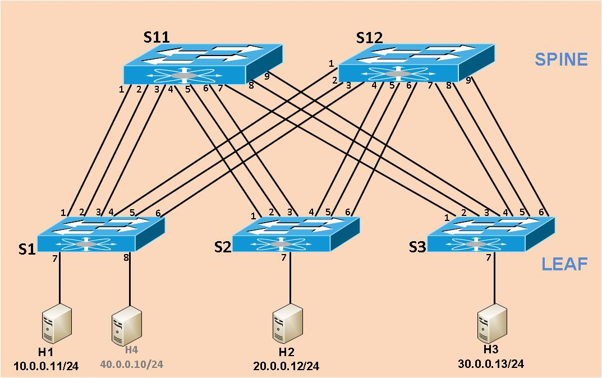

# P4-RESISTING-bmv2

This repository contains the P4 based implementation of RESISTING for BMv2 and running scripts.

### Quick Start:
* Compile the P4 RESISITING for bmv2 using the `p4c` compiler
* Execute the RESISTING program using the mininet with simple_switch software switch  
* Add table and register entries to the running the RESISTING program
* Send packets to the running RESISTING using mininet and testing the FRR ECMP mechanism running link failures

### Network Topology 


### Installation and Compiling
clone P4-RESISTING-bmv2
```
git clone https://github.com/danielbl1000/P4-RESISTING-bmv2.git
```


To compile RESISTING code:
```
cd P4-RESISTING-bmv2/src/
```
```
./p4c_bmv2_6p_frr_v2_resisting.sh
```


### RUNNING
To start the RESISTING with a mininet topology:
```
cd P4-RESISTING-bmv2/run/
```
```
./run_MN_Top_v1.sh
```


`.........................................`


### Adding rules 
Inside the `run` folder, run `./Add_Rules_S1_S2_S3_S11_S12.sh`


### Sending traffic 
Inside the mininet cli, run `ping` or `iperf` to send packets from host h1 to h2 and h3


### Link Failures

The main point here is show ingress and egress registers (Fwd and FRR) working, dealing with multiple failures without interruption of traffic between hosts 

Check S1 Registers: inside the `run` folder, run `./Sh-Regs-all.sh`


Before failures, inside the mininet cli, run specific ping (h1 -> h2 sec ip) to deal all ECMP Links during the failures: `h1 ping 20.0.0.15`


Inside the `run` folder, run that command to setup port status down: P1, P2, P3, P4 and P5 
```
./run_S1_failures-link-0-1-2-3-4-p1-p2-p3-p4-p5-Down.sh
```


`.........................................`


Check again S1 Registers: inside the `run` folder, run `./Sh-Regs-all.sh`

All ports were excluded in forwarding registers, except the port P6


we see just one ECMP link active 


All ports were excluded in FRR registers, except the port P6


No packet loss


